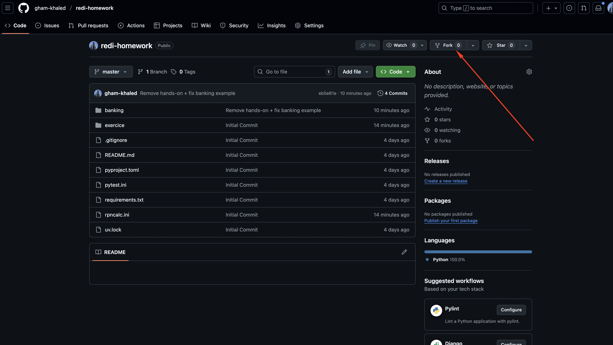
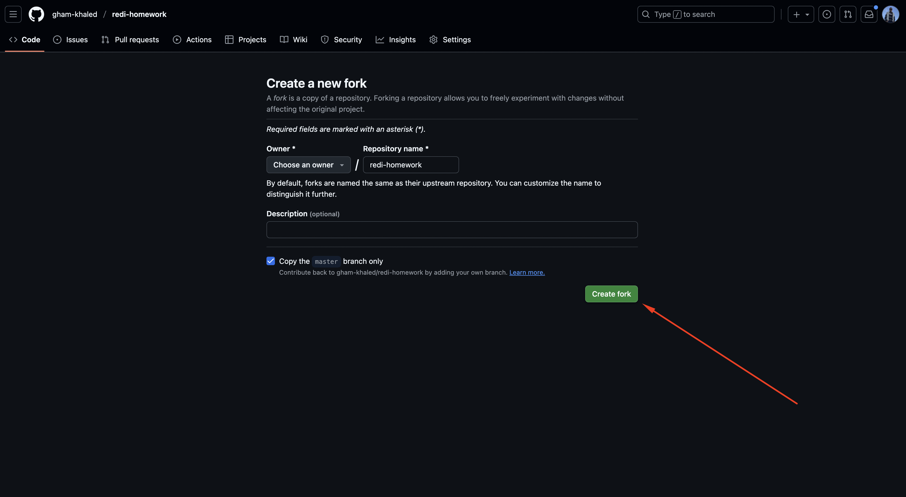
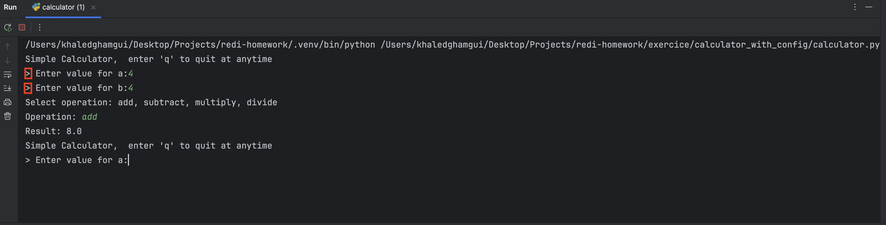

# Redi Homework: Calculator Testing Assignment (100 Points)

## Grading Breakdown
- Forking and setup: **10 Points**
- Part 1.1: Run the calculator: **10 Points**
- Part 1.2: Run the tests: **10 Points**
- Each TODO in the code: Points are indicated next to each TODO
- Part 2.1: Run the calculator with config: **10 Points**
- Part 2.2: Complete the fixture and run tests: **10 Points**
- Total: **100 Points**
- **Passing score: 60 Points**

## Submission Instructions: Fork, Complete, and Submit

Before starting the assignment, you must fork the repository, complete the tasks, push your changes, and send the link to your forked repository.

## Steps to Submit Your Assignment

1. **Fork the repository** (**10 Points**)
   - Go to [https://github.com/gham-khaled/redi-homework](https://github.com/gham-khaled/redi-homework)
   - Click the "Fork" button in the top right corner.
   - Refer to the screenshots below for guidance:
     - 
     - 

2. **Clone your forked repository**
   - Replace `<your-username>` with your GitHub username:
   ```bash
   git clone https://github.com/<your-username>/redi-homework.git
   cd redi-homework
   ```

3. **Create a virtual environment and install dependencies**
   - On macOS/Linux:
   ```bash
   python3 -m venv venv
   source venv/bin/activate
   pip install -r requirements.txt
   ```
   - On Windows:
   ```bash
   python -m venv venv
   venv\Scripts\activate
   pip install -r requirements.txt
   ```

4. **Complete the assignment**
   - Follow the instructions below for both parts.

5. **Commit and push your changes**
   ```bash
   git add .
   git commit -m "Complete calculator testing assignment"
   git push origin main
   ```
   *(If your default branch is not `main`, use the correct branch name)*

6. **Send the link to your forked repository**
   - Email or message the link to your forked repository to your instructor.

---

## Part 1: Normal Calculator

### What does it do?
The calculator implements basic arithmetic operations: addition, subtraction, multiplication, and division. You will find the implementation and tests in:
- `exercice/calculator/calculator.py`
- `exercice/calculator/test_calculator.py`

### 1.1 Run the Calculator
To run the calculator and see its output, use the following command:

```bash
python exercice/calculator/calculator.py
```


Take a screenshot of the output and include it in your submission.

### 1.2 Run the Tests
All tests should succeed without changing the application code. To run the tests, use:

```bash
pytest exercice/calculator/test_calculator.py
```

Take a screenshot of the test results and include it in your submission.

---

## Part 2: Calculator with Config

### What does it do?
This version of the calculator loads its prompt from a configuration file. The config is used to customize the prompt shown to the user.
- Implementation: `exercice/calculator_with_config/calculator.py`, `exercice/calculator_with_config/config.py`
- Tests: `exercice/calculator_with_config/test_calculator.py`
- Fixtures: `exercice/calculator_with_config/conftest.py`

### 2.1 Run the Calculator
To run the calculator with config, use:

```bash
python exercice/calculator_with_config/calculator.py
```



Take a screenshot of the output and include it in your submission.

### 2.2 Complete the Fixture
Open `exercice/calculator_with_config/conftest.py` and complete the `config` fixture as described in the TODO:
- The fixture should return a `MagicMock` object.
- The mock object should have a method `get_prompt` that returns the string `">"`.

Once completed, run the tests:

```bash
pytest exercice/calculator_with_config/test_calculator.py
```

All tests should pass. Take a screenshot of the test results and include it in your submission.

---

## Submission Checklist
- [ ] Screenshot of running the normal calculator
- [ ] Screenshot of passing tests for the normal calculator
- [ ] Screenshot of running the calculator with config
- [ ] Screenshot of passing tests for the calculator with config
- [ ] Completed fixture in `conftest.py`

Good luck!
